# How psa.py works

A process-by-process walk through the pipeline: what happens between
`./psa.py image.jpg` and an annotated, plate-solved sky image, which
algorithms and data sources are involved at each step, and why the design
looks the way it does. Function names refer to [`psa.py`](../psa.py).

1. [Why this exists](#1-why-this-exists)
2. [Running model: one file, resolved on demand](#2-running-model-one-file-resolved-on-demand)
3. [Image loading and normalization](#3-image-loading-and-normalization)
4. [Scale hints from metadata](#4-scale-hints-from-metadata)
5. [Star extraction](#5-star-extraction)
6. [Plate solving](#6-plate-solving)
7. [The WCS solution and outputs](#7-the-wcs-solution-and-outputs)
8. [The annotation engine](#8-the-annotation-engine)
9. [Catalogs and databases](#9-catalogs-and-databases)
10. [Validation and performance](#10-validation-and-performance)
11. [Limitations](#11-limitations)
12. [References](#12-references)

---

## 1. Why this exists

Local plate solving is conventionally assembled from a distribution package
of [astrometry.net](http://astrometry.net) plus a small shell wrapper:
`solve-field` produces a WCS solution, `plot-constellations` draws an
overlay from it. That pattern works — until the system around it moves.
Three failure classes show up in practice (see the
[README background section](../README.md#background-the-pipeline-this-replaces)
for the full account):

- **Interpreter coupling.** `solve-field` shells out to `image2pnm`, a
  Python helper installed into a *versioned* site-packages directory. A
  routine system Python upgrade orphans it and every solve fails with
  `ModuleNotFoundError` — including FITS input, which passes through the
  same file-type sniffing — while the package manager reports nothing wrong.
- **Hand-maintained survey data.** Index files and catalogs accumulate in a
  system directory via ad-hoc `wget` scripts, with no record of which
  scales were chosen or why, and nothing validating them afterwards.
- **A wide native dependency surface.** cfitsio, wcslib, GSL, cairo,
  netpbm, libcurl — all of which must stay in step with the OS.
- **Always-blind invocation.** A fixed wrapper command line
  (`--downsample 2 --objs 1000`) with no plumbing for solve-field's own
  scale/position hints, so every solve searched the full scale ladder and
  the whole sky — which is what made very wide frames marginal under the
  engine's CPU budget (§10). The engine was never the limitation; the
  invocation was.

`psa.py` keeps the proven part — the astrometry.net solving engine itself —
and replaces everything around it with Python libraries that install from
wheels and data that bootstraps itself into a per-user cache:

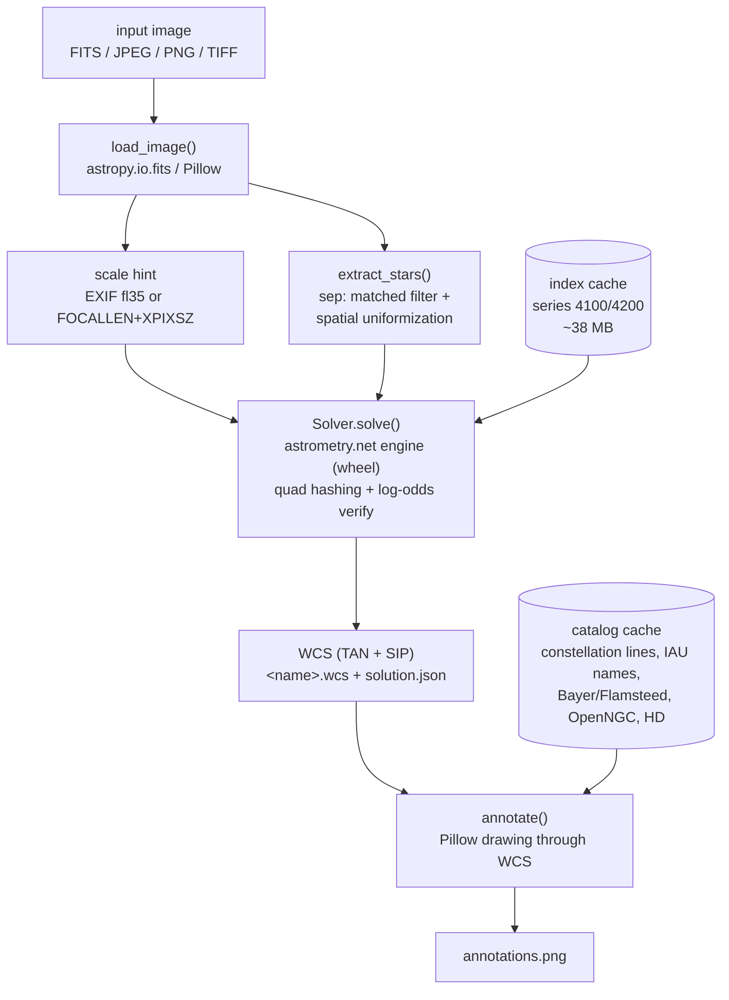

First run downloads ~45 MB (index files + catalogs) into `~/.cache/psa/`;
after that the whole pipeline runs offline.

## 2. Running model: one file, resolved on demand

The script opens with a [PEP 723](https://peps.python.org/pep-0723/) inline
metadata block and a [uv](https://docs.astral.sh/uv/guides/scripts/)
shebang:

```python
#!/usr/bin/env -S uv run --script
# /// script
# requires-python = ">=3.10"
# dependencies = ["astrometry>=4.1.2,<5", "astropy>=5.3", "numpy>=1.24",
#                 "sep>=1.2.1", "pillow>=10.1"]
# ///
```

Executing `./psa.py` makes uv resolve those five dependencies into a cached
virtual environment — there is nothing to install system-wide, and the
environment is isolated from whatever Python the OS ships. This isolation
matters beyond convenience: the astrometry.net *project* also installs a
Python package named `astrometry` (utility scripts), which would shadow the
PyPI solver package in a shared environment. The script guards against
exactly that at import time and refuses to run against the wrong module.

The five dependencies, and what each replaces from the classic pipeline:

| dependency | role | replaces |
|---|---|---|
| [`astrometry`](https://github.com/neuromorphicsystems/astrometry) | the astrometry.net C engine compiled as a Python extension, plus programmatic index-file downloads | `solve-field`, `astrometry-engine`, wget scripts |
| [`astropy`](https://docs.astropy.org) | FITS I/O, WCS math (TAN+SIP evaluation and inversion) | cfitsio, wcslib |
| [`sep`](https://sep.readthedocs.io) | background estimation + source extraction (Source-Extractor as a library) | `simplexy`/`image2xy` |
| [`Pillow`](https://pillow.readthedocs.io) | raster decoding, EXIF, all overlay drawing | netpbm, `image2pnm`, cairo |
| `numpy` | everything in between | — |

All of these invocations are equivalent — pick whichever fits the machine:

```console
$ ./psa.py image.fit                    # shebang → uv resolves everything
$ uv run psa.py image.fit               # explicit uv
$ pip install 'astrometry>=4.1.2,<5' astropy numpy sep pillow
$ python psa.py image.fit               # plain venv fallback
```

## 3. Image loading and normalization

`load_image()` returns three things: a 2-D float32 grayscale array for
detection, an RGB rendering for the annotation backdrop, and (if metadata
allows) a pixel-scale hint for the solver.

**FITS path** (`.fit/.fits/.fts/.fz`): the first HDU carrying ≥2-D data is
used. Stacker output is commonly a 3-plane cube — Siril writes
`(3, H, W)` — so 3-D data is averaged over its channel axis (detected as
the smallest axis). NaNs are replaced with the image minimum. For display,
the linear data is stretched with a percentile window and a square root:

$$ d = \sqrt{\mathrm{clip}\left(\frac{I - P_{0.5}}{P_{99.8} - P_{0.5}},\ 0,\ 1\right)} $$

i.e. the 0.5th percentile maps to black, the 99.8th to white, with a
gamma-like lift for the faint end.

**Raster path** (JPEG/PNG/TIFF): decoded with Pillow; 16-bit integer and
float modes are taken as-is, color images are averaged across channels for
detection. One deliberate choice: **EXIF orientation is *not* applied.**
The WCS maps *pixel grid* coordinates to the sky, so the solution must
refer to the file's raw pixel layout — the same convention `solve-field`
uses. Annotations are drawn on the same un-rotated grid, so everything
stays consistent.

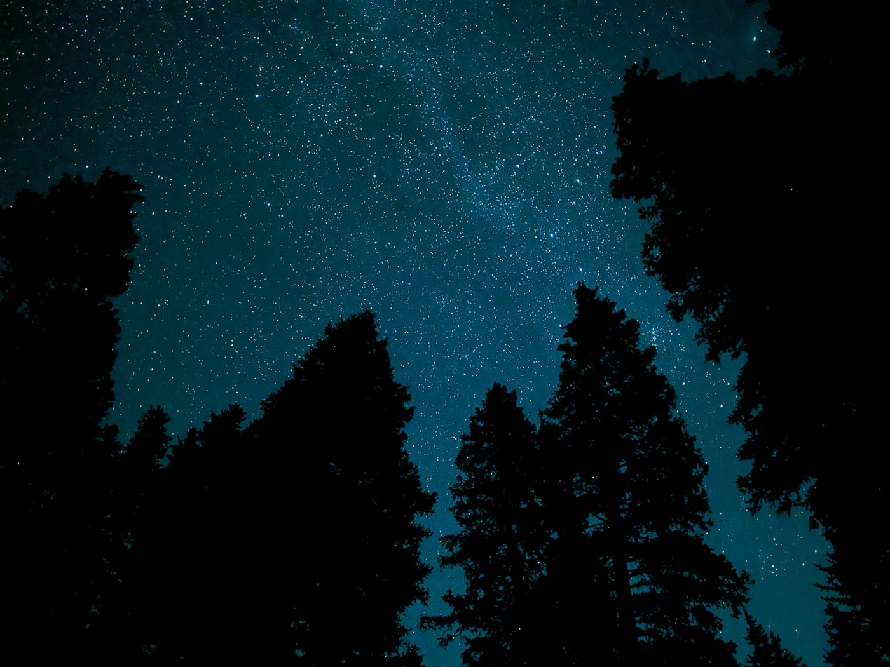

*A worst-case input frame: a hand-held 73° phone shot with roughly 40 %
foreground occlusion and EXIF stripped by a messaging-app re-encode. Every
stage downstream has to survive frames like this one — it reappears
throughout this document.*

## 4. Scale hints from metadata

Blind solving means searching all plausible image scales, which dominates
solve time on wide fields. But most files already know their scale, at
least approximately, and `load_image()` reads it:

- **Camera files:** the EXIF *FocalLengthIn35mmFilm* tag ($f_{35}$, tag
  41989). On a 35 mm-equivalent frame (36 mm wide), the horizontal field of
  view and implied pixel scale are

$$ \mathrm{FOV} = 2\arctan\frac{36}{2 f_{35}}, \qquad
   \mathrm{arcsec/px} = \frac{\mathrm{FOV} \cdot 3600}{W}. $$

  The hint is the range ×[0.6, 1.6] around that estimate, loose enough to
  absorb digital zoom and crop modes.

- **FITS:** capture and stacking software (INDI/Ekos, Siril) records the
  optical train as `FOCALLEN` (mm) and `XPIXSZ` (µm), giving the classic

$$ \mathrm{arcsec/px} = 206.265 \cdot \frac{\mathrm{XPIXSZ}}{\mathrm{FOCALLEN}}, $$

  hinted at ×[0.7, 1.4] (206 265 is the number of arcseconds per radian).

The implementation is a few lines in `load_image()` (abridged):

```python
# camera files: EXIF FocalLengthIn35mmFilm (tag 41989, private IFD 0x8769)
fl35 = img.getexif().get_ifd(0x8769).get(41989)
if fl35:
    fov_deg = math.degrees(2 * math.atan(36.0 / 2.0 / float(fl35)))
    hint = (fov_deg * 3600.0 / img.size[0]) * np.array([0.6, 1.6])

# FITS: optical train recorded by capture/stacking software
focal = hdu.header.get("FOCALLEN") or hdul[0].header.get("FOCALLEN")
pixsz = hdu.header.get("XPIXSZ") or hdul[0].header.get("XPIXSZ")
if focal and pixsz:
    hint = (206.265 * float(pixsz) / float(focal)) * np.array([0.7, 1.4])
```

When a hint is found, the solve log shows it being applied — this is a real
run on a night-mode phone JPEG whose EXIF reports a 27 mm-equivalent lens:

```console
$ ./psa.py PXL_20250930_042446101.NIGHT.jpg
...
  extracted 1000 sources (3024x4032, downsample 2)
  scale hint from image metadata: 48.1-128.3 arcsec/px
  solved in 1.6s using index-4118.fits
```

The measured effect is dramatic (§10): a 67°-wide phone frame that blind
search couldn't finish in 15 minutes solves in **1.8 s** with its EXIF
hint; a Siril stack solves in **1.6 s** from its FITS headers. Explicit
`--scale-low/--scale-high` or `--ra/--dec/--radius` flags override the
metadata, and `--no-auto-hint` forces a true blind solve.

## 5. Star extraction

The solver consumes nothing but a list of $(x, y)$ star centroids, ordered
brightest-first. Getting that list *right* turned out to be the hardest
problem in the port — two natural-seeming ranking strategies fail on real
images in opposite ways.

`extract_stars()` first block-averages the image by the `--downsample`
factor (default 2, matching `solve-field --downsample 2`), then estimates
and subtracts the spatially varying background with
[sep](https://sep.readthedocs.io)'s mesh-based estimator
(`sep.Background`, the Source-Extractor algorithm of
[Bertin & Arnouts 1996](https://ui.adsabs.harvard.edu/abs/1996A%26AS..117..393B)).

**Failure mode 1 — ranking by total flux.** Source-Extractor's isophotal
flux sums every pixel above threshold, so any large bright *region* beats a
star. On the occluded frame, sky gaps between branches are the brightest
"objects" in the field:

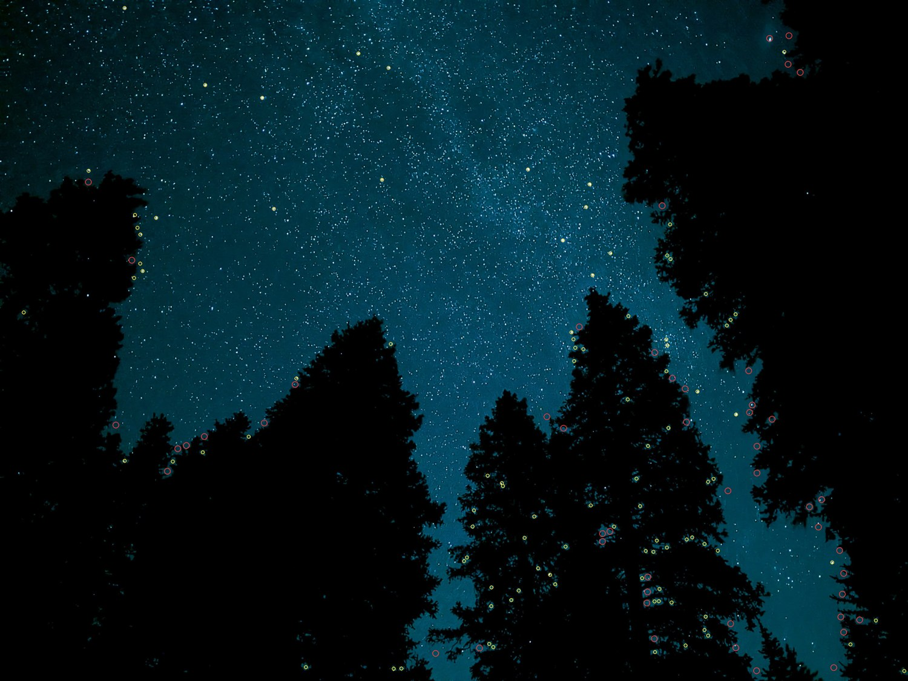

*Top-150 candidates ranked by raw isophotal flux: nearly every circle sits
on a bright sky-gap between branches, not on a star. Quad matching never
sees the real field, and the solve grinds indefinitely.*


*The same frame through the final extractor (matched filter + spatial
uniformization): candidates land on real stars across the open sky, and the
silhouettes contribute almost nothing.*

**Failure mode 2 — ranking by peak pixel.** The opposite strategy — rank
by the brightest single pixel — defeats the tree gaps but falls to
computational photography. Phone "night modes" align and stack bursts;
the result is heavily denoised in the well-overlapped center while the
frame edges keep sharp residual noise. Those noise spikes out-peak real
stars, which the denoiser has smeared:

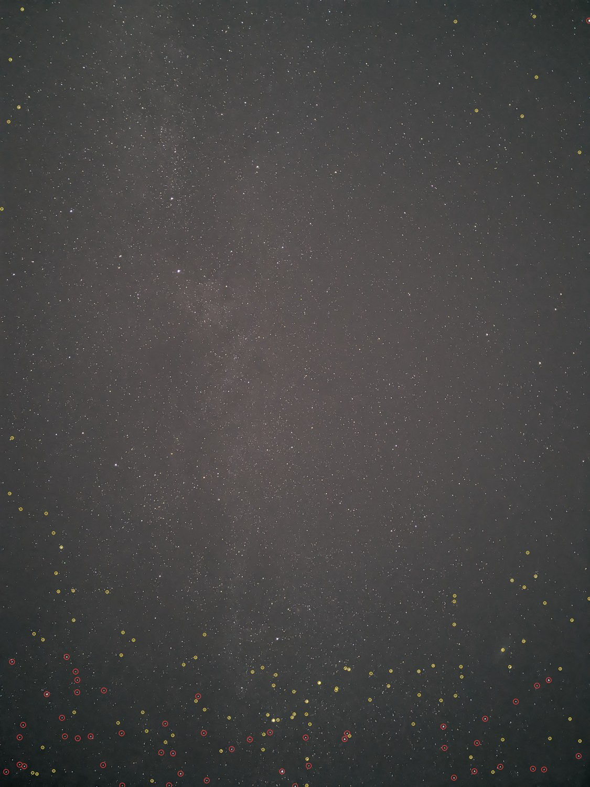

*Ranking by single-pixel peak on a night-mode phone frame: detections
cluster along the bottom and edges where stacking left sharp noise, while
the obvious stars mid-frame go unselected.*

**The fix is the matched filter, plus uniformity.** Detection theory says
the optimal detector for a PSF-shaped source in noise is correlation with
the PSF itself. `_gaussian_smooth()` applies a separable Gaussian
($\sigma = 1$ px, the approach of astrometry.net's own
[simplexy](https://github.com/dstndstn/astrometry.net/blob/main/util/simplexy.c)),
and extraction runs on the *smoothed* image: a single-pixel spike is
attenuated by the kernel, an extended blob gains nothing at its peak, and a
star — which matches the kernel — keeps its height. Candidates are ranked
by smoothed peak, filtered for roundness (semi-axis ratio $a/b < 3$), and
finally **spatially uniformized**: the image is divided into a 10×10 grid
and stars are taken round-robin — every cell's brightest first, then every
cell's second-brightest, and so on (the same idea as solve-field's
`uniformize` step). No region, however contaminated, can crowd the others
out of the candidate list.

The whole strategy is compact in `extract_stars()` (abridged):

```python
bkg = sep.Background(work)                                # SExtractor mesh
smooth = _gaussian_smooth(work - bkg.back(), sigma=1.0)   # matched filter
err = float(sep.Background(smooth).globalrms) or 1.0
objs = sep.extract(smooth, thresh=threshold, err=err,     # detect on the
                   minarea=5, filter_kernel=None)         # smoothed image
objs = objs[objs["a"] / np.maximum(objs["b"], 1e-6) < 3.0]  # roundness

# uniformize: every grid cell's brightest star first, then every cell's
# second-brightest, ... so no region can crowd out the others
cell = gy * G + gx                                        # G = 10
for pos in np.argsort(objs["peak"])[::-1]:                # bright -> faint
    rank_in_cell[pos] = seen.get(int(cell[pos]), 0)
    seen[int(cell[pos])] = rank_in_cell[pos] + 1
order = np.lexsort((-objs["peak"], rank_in_cell))[:max_objs]
```

Extraction is tunable from the command line when a frame misbehaves —
`--threshold` in background sigmas, `--objs` for list depth, and
`--downsample 1` to extract at native resolution:

```console
$ ./psa.py faint_field.fit --threshold 3.5 --objs 2000 --downsample 1
```

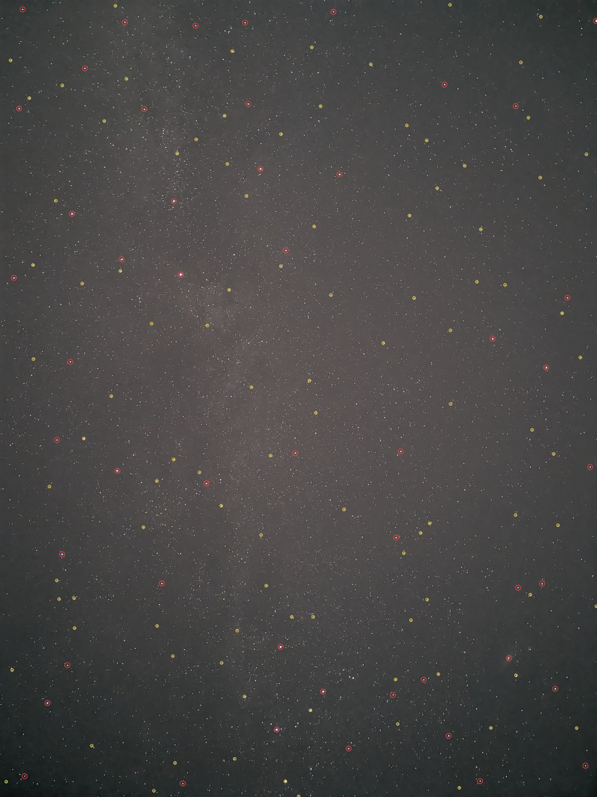

*Matched-filter ranking with 10×10 uniformization on the night-mode frame:
every region contributes its brightest point sources. This change alone
took the frame from unsolvable-in-15-minutes to solved in 1.8 seconds.*

Two robustness details: very dense fields can overflow sep's deblender, in
which case extraction retries with deblending disabled (a merged star pair
is still a perfectly good centroid for solving); and detected coordinates
are mapped back to full-resolution pixel centers as
$x_\mathrm{full} = N x + (N-1)/2$ for downsample factor $N$.

## 6. Plate solving

Solving is performed by the genuine astrometry.net engine — the same C code
behind `solve-field` and nova.astrometry.net — compiled into the
[`astrometry`](https://github.com/neuromorphicsystems/astrometry) wheel.
The algorithm is described in
[Lang et al. 2010](https://arxiv.org/abs/0910.2233); in brief:

1. **Quads as geometric hashes.** Take four stars; let the most widely
   separated pair define a local coordinate frame. The positions of the
   remaining two stars in that frame form a 4-vector, the *geometric hash
   code* — invariant to translation, rotation, and scale of the image.
2. **Index lookup.** An *index file* is a catalog of quads precomputed from
   a sky survey, stored in kd-trees keyed by those codes. Each field quad's
   code is looked up within a small tolerance, yielding candidate
   sky locations.
3. **Bayesian verification.** Each candidate alignment is scored by
   accumulating log-odds over the predicted vs detected star positions
   (with explicit foreground/background and distractor models). A match is
   accepted only when the odds exceed $10^9$
   (`output_logodds_threshold = ln(10^9) ≈ 20.7`) — which is why
   astrometry.net essentially never returns a *wrong* solution; it returns
   the right one or none. `psa.py` stops at the first accepted match, like
   `solve-field`.

The engine invocation in `solve()` (abridged) — the star list, optional
hints, and acceptance policy are the entire interface:

```python
solver = astrometry.Solver(index_files)
solution = solver.solve(
    stars=xy.tolist(),                # (x, y) centroids, brightest first
    size_hint=size_hint,              # arcsec/px bounds, or None = blind
    position_hint=position_hint,      # RA/Dec/radius, or None = all-sky
    solution_parameters=astrometry.SolutionParameters(
        sip_order=3,
        output_logodds_threshold=math.log(1e9),   # accept at 10^9:1 odds
        logodds_callback=lambda _: astrometry.Action.STOP,  # first match
    ),
)
```

A complete real run, blind, on a 103-megapixel stack:

```console
$ ./psa.py cassiopeia.jpg
Running plate solving on: cassiopeia.jpg
Output directory: cassiopeia Solved
Step 1: solving ...
  extracted 1000 sources (12455x8250, downsample 2)
  solved in 21.6s using index-4111.fits
  center: RA 01:00:20.471 (15.085296), Dec +56:01:08.070 (+56.018908)
  pixel scale: 3.0002 arcsec/px, field 10.4 x 6.88 deg
  rotation: up is -90.66 deg E of N, parity neg
  wrote cassiopeia Solved/cassiopeia.wcs
Step 2: annotating ...
  drew 1 constellations, 4 named + 1 bayer stars, 6 NGC/IC
  wrote cassiopeia Solved/annotations.png
```

**Index files.** The engine searches whatever indexes it is given.
`get_index_files()` downloads them programmatically (with the chosen scales
recorded by construction — no more mystery data directories) from
[data.astrometry.net](https://data.astrometry.net). Defaults are series
**4100** (built from [Tycho-2](https://ui.adsabs.harvard.edu/abs/2000A%26A...355L..27H))
and **4200** (built from [2MASS](https://ui.adsabs.harvard.edu/abs/2006AJ....131.1163S)),
scales 11–19 — quad sizes from 85′ to 2000′ (≈1.4°–33°), about 38 MB total,
appropriate for camera-lens fields from a few degrees up to all-sky.
The guidance from the astrometry.net project is that indexes should contain
quads roughly 10–50 % of your image width:

| scale | quad size | suits image width ≈ |
|---|---|---|
| 11 | 1.4°–2° | 3°–14° |
| 13 | 2.8°–4° | 6°–28° |
| 15 | 5.7°–8° | 11°–57° |
| 17 | 11°–17° | 23°–113° |
| 19 | 23°–33° | 47°–230° |

Telescope-scale fields want deeper scales (e.g. `--series 4200 --scales
7-12`, or the Gaia-DR2-based 5200 series for arcminute fields) — pass
`--series`/`--scales` and the right files are fetched into the same cache.

## 7. The WCS solution and outputs

A successful match yields a [FITS WCS](https://fits.gsfc.nasa.gov/fits_wcs.html):
a gnomonic (TAN) projection ([Greisen & Calabretta 2002](https://ui.adsabs.harvard.edu/abs/2002A%26A...395.1061G);
[Calabretta & Greisen 2002](https://ui.adsabs.harvard.edu/abs/2002A%26A...395.1077C))
plus [SIP polynomial distortion](https://ui.adsabs.harvard.edu/abs/2005ASPC..347..491S)
terms (order 3 by default, `--sip-order`) that absorb lens distortion —
essential for camera lenses, where corners can sit many pixels off a pure
TAN model. Everything written to `"<name> Solved/"`:

- **`<name>.wcs`** — a header-only FITS file with the solution (plus
  `IMAGEW`/`IMAGEH`). It is byte-compatible with astrometry.net tooling:
  `wcsinfo`, `plot-constellations -w`, `wcs-rd2xy` all read it directly.
  Example: [`samples/cassiopeia.wcs`](samples/cassiopeia.wcs). Reading the
  solve above back with the *original* C tool:

  ```console
  $ wcsinfo "cassiopeia Solved/cassiopeia.wcs" | grep -E 'center|pixscale|field'
  pixscale 3.00018257877
  ra_center 15.0852958881
  dec_center 56.0189082019
  fieldw 10.37
  fieldh 6.888
  ```
- **`annotations.png`** — see §8.
- **`solution.json`** — a machine-readable summary: center (degrees and
  HMS/DMS), pixel scale, field size, rotation (reported in `wcsinfo`'s
  east-of-north convention, measured through the full SIP model at field
  center), parity, the index file that matched, the verification log-odds,
  and annotation counts. Examples:
  [blind solve](samples/solution-cassiopeia.json) ·
  [metadata-hinted solve](samples/solution-pxl-hinted.json).

```json
{
  "input": "cassiopeia.jpg",
  "solve_seconds": 21.63,
  "ra_center_hms": "01:00:20.471",
  "dec_center_dms": "+56:01:08.070",
  "pixscale_arcsec": 3.0002,
  "field_deg": [10.38, 6.88],
  "index": "index-4111.fits",
  "logodds": 2243.1
}
```

## 8. The annotation engine

`annotate()` replaces `plot-constellations`: it projects catalog objects
through the solved WCS and draws them with Pillow.

- **Field culling** happens on the unit sphere: every catalog position is a
  3-vector, and objects within the field radius satisfy
  $\vec{v}\cdot\vec{c} \ge \cos r$ for field center $\vec{c}$ — one
  vectorized dot product per catalog.
- **Sky→pixel** uses astropy's `all_world2pix`, which iteratively inverts
  the SIP polynomial so annotations stay accurate into distorted corners.
- **Constellation lines curve.** A straight catalog segment is a great
  circle, which is *not* a straight line in a wide-field projection.
  `subdivide_segment()` interpolates along the great circle (spherical
  linear interpolation, $p(t) = \frac{\sin((1-t)\theta)\,\vec{v_1} +
  \sin(t\theta)\,\vec{v_2}}{\sin\theta}$, in 2° steps) before projecting,
  so figures bend correctly across 60°+ fields.
- **Legibility at any resolution.** Line widths and font sizes scale with
  the image diagonal; every glyph and line is drawn twice — black underlay,
  then color — so labels read on both dark sky and bright nebulosity; and a
  greedy collision pass skips labels that would overlap one already placed.

Each layer is independently controllable:

```console
$ ./psa.py stack.fit --hd --hd-max 300        # add HD numbers, capped
$ ./psa.py wide.jpg --ngc-mag 13 --bright-mag 5   # deeper object/star cuts
$ ./psa.py img.jpg --no-ngc --font-size 28 --line-width 4
$ ./psa.py img.jpg --transparent              # overlay-only RGBA output
```

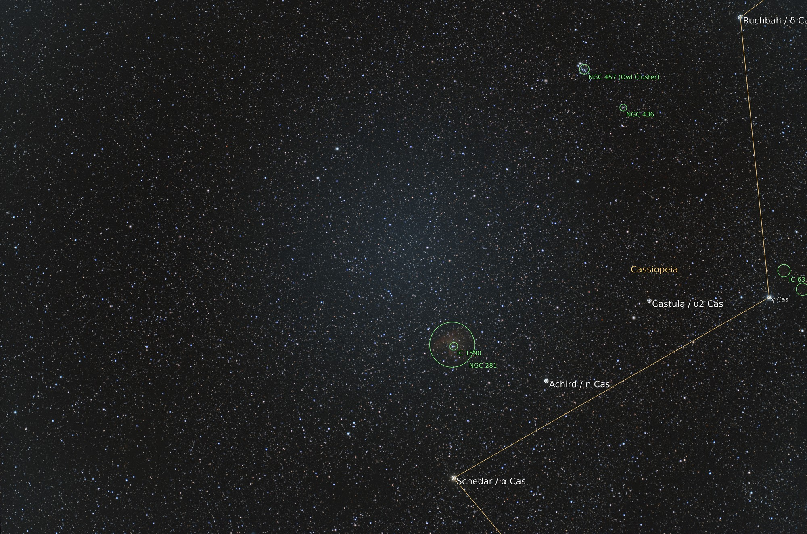

*Default output: annotations composited over the stretched source image
(12 455 × 8 250 px DSLR stack, 10.4° field, solved blind in 22 s) —
constellation figure and name, IAU star labels, and NGC/IC extent circles.*

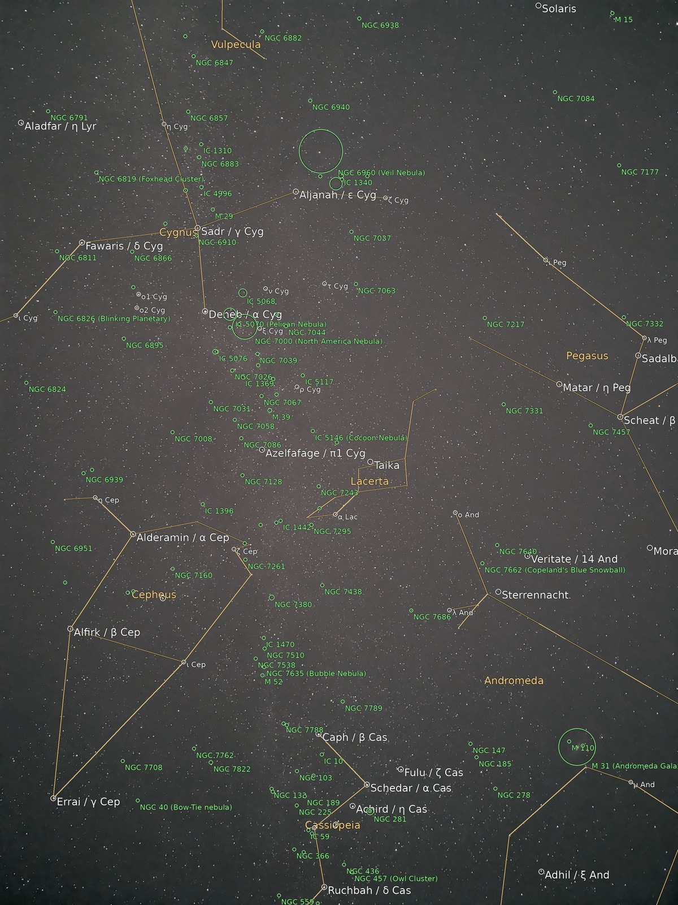

*A 54°×73° night-mode phone frame annotated end-to-end: seven
constellations with correctly curved figures, the North America and Veil
nebulae, M 39, M 52, and M 31 circled by name at lower right — solved in
1.8 s from its EXIF hint.*

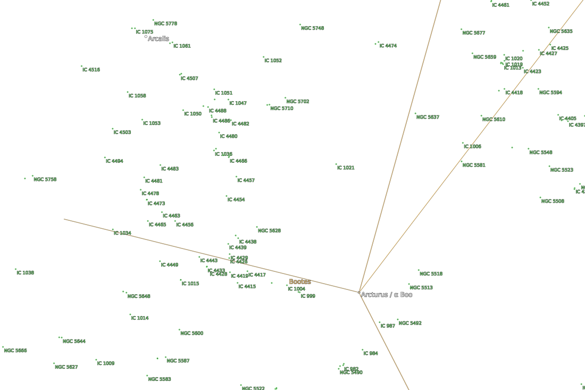

*`--transparent` reproduces the classic plot-constellations behavior: an
RGBA overlay with no background image, still readable on any backdrop
thanks to the black halo pass.*

## 9. Catalogs and databases

Annotation data is fetched once into `~/.cache/psa/catalogs/` (raw form),
compiled to compact NumPy `.npz` archives, and never touched again — this
is what makes the script offline-able while staying a single file. All
sources are openly licensed:

| layer | source | license | size | objects |
|---|---|---|---|---|
| constellation lines | [d3-celestial](https://github.com/ofrohn/d3-celestial) `constellations.lines.json` | BSD-3 | ~110 kB | 88 figures, 743 segments |
| IAU proper names | [IAU WGSN catalog (IAU-CSN)](https://www.pas.rochester.edu/~emamajek/WGSN/IAU-CSN.txt) | CC-BY | ~60 kB | 451 named stars |
| Bayer/Flamsteed stars | d3-celestial `stars.6.json` + `starnames.json`, joined on HIP | BSD-3 | ~1.2 MB | 2 954 designated stars |
| NGC / IC / Messier | [OpenNGC](https://github.com/mattiaverga/OpenNGC) | CC-BY-SA-4.0 | ~2.3 MB | 12 038 kept objects |
| Henry Draper numbers | [`hd.fits`](http://data.astrometry.net/hd.fits) from astrometry.net | — | 4.5 MB | 272 150 stars |

Notes on the less obvious ones:

- **Two star-label layers.** The IAU list contains only officially named
  stars — which omits bright, famous objects like γ Cas (mag 2.4, never
  given an IAU proper name). The Bayer/Flamsteed layer fills that gap from
  d3-celestial's HIP-keyed designation table, deduplicated against the IAU
  layer by HIP number and capped at `--bright-mag` (default 4.0).

  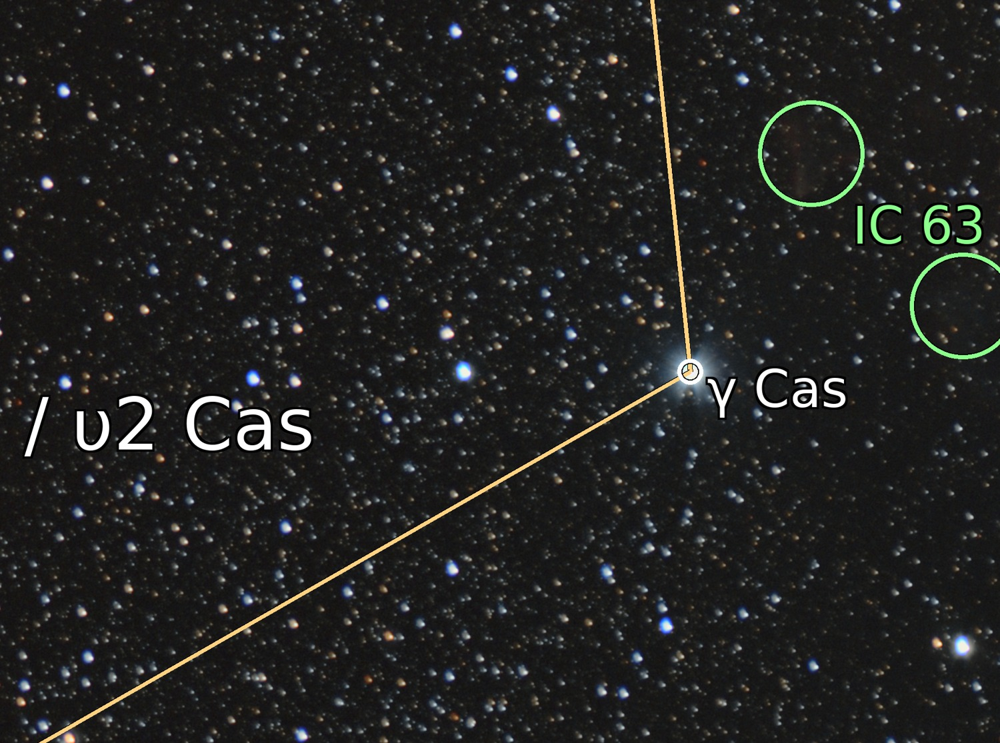

  *γ Cas — second-magnitude but never formally named — labeled at the
  middle vertex of Cassiopeia's W by the Bayer layer, with IC 63 (the Ghost
  Nebula) correctly circled beside it.*

- **OpenNGC is complete, which is too much.** It includes thousands of
  mag-14+ anonymous galaxies that would carpet a wide field. The visibility
  filter keeps an object if it is brighter than `--ngc-mag` (default 12),
  *or* carries a common name, *or* is a Messier object, *or* is ≥ 5′
  across — i.e. everything someone would actually look for.
- **`hd.fits` is a kd-tree, not a table.** The Henry Draper catalog file
  shipped by astrometry.net is a serialized
  [libkd](https://github.com/dstndstn/astrometry.net/tree/main/libkd)
  structure: unit-sphere xyz positions stored as scaled `uint32`
  ($x = \mathrm{min} + \mathrm{raw}/\mathrm{scale}$, bounds and scale in a
  `kdtree_range` HDU), in **native byte order** declared by an `ENDIAN`
  header card, with the HD number of tree point $i$ recovered as
  $\mathrm{perm}[i] + 1$ from the permutation HDU. `load_hd()` decodes all
  of that with plain NumPy and caches the result as RA/Dec/HD arrays
  (abridged):

  ```python
  endian = "<" if header.get("ENDIAN") == "04:03:02:01" else ">"
  pts = data_bytes.view(endian + "u4").reshape(n, 3).astype("f8")
  rng = range_bytes.view(endian + "f8")   # minval[3], maxval[3], scale
  pts = rng[:3] + pts / rng[6]            # -> unit-sphere xyz
  ra  = np.degrees(np.arctan2(pts[:, 1], pts[:, 0])) % 360.0
  dec = np.degrees(np.arcsin(pts[:, 2]))
  hd  = perm.astype("u4") + 1             # tree order -> HD number
  ```

  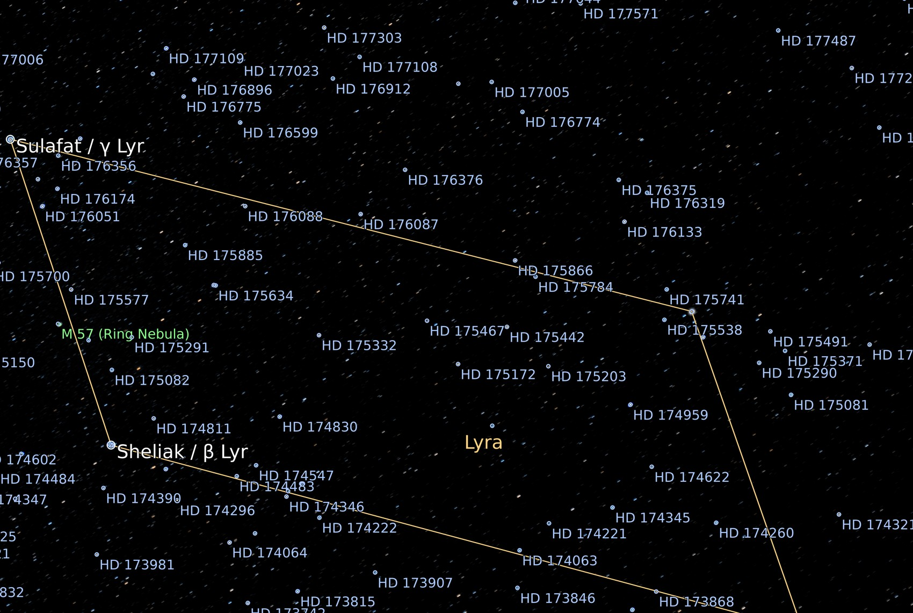

  *`--hd` on the Lyra parallelogram: Henry Draper numbers attached to field
  stars (nearest-to-detection preferred, capped by `--hd-max`), with M 57 —
  the Ring Nebula — labeled between Sheliak and Sulafat.*

Every layer has a self-test: `./psa.py --check` verifies known objects
against their catalog entries — a one-command answer to "is my cache
intact?" Real output:

```console
$ ./psa.py --check
  constellation lines: 743 segments, 88 constellations, Lyra present: True
  bright stars: 451 named
    Vega: α Lyr at RA 279.2347 Dec +38.7837 (offset 0.1 arcsec, expect < 5)
  bayer/flamsteed stars: 2954
    HIP 4427 -> 'γ Cas' mag 2.15 (expect 'γ Cas' ~2.2)
  NGC/IC objects: 12038
    M 57 at RA 283.3959 Dec +33.0286 (offset 1.5 arcsec, expect < 60)
  HD stars: 272150
    Vega: nearest HD 172167 at 3.0 arcsec (expect HD 172167)
    Sirius: nearest HD 48915 at 11.6 arcsec (expect HD 48915)
catalog check: OK
```

## 10. Validation and performance

The port was validated against archived `solve-field` /
`plot-constellations` solutions of the same images, using the original
`wcsinfo` to read **both** solutions (which simultaneously proves the
`.wcs` files interoperate). Center positions, pixel scales, and full
corner-to-corner sky mappings were compared through each solution's
complete TAN+SIP model:

| image | field | solve time | vs reference solution |
|---|---|---|---|
| Cassiopeia field, DSLR stack JPEG (12455×8250) | 10.4°×6.9° | 22 s blind | center Δ≈5″, scale Δ0.08 %, corner mapping ≤34″ |
| Lyra/M57 field, DSLR stack JPEG | 10.5°×7.0° | 13 s blind | center Δ≈5″ |
| Night-mode phone frame (EXIF intact) | 54°×73° | **1.8 s** hinted | center Δ≈5 px, scale Δ0.6 % |
| Siril-stacked FITS (`FOCALLEN`/`XPIXSZ`) | 15.7°×10.5° | **1.6 s** hinted | center Δ≈5″ vs same-night solve |
| Occluded phone frame (§3), EXIF stripped | 73°×55° | 8.5 min with `--scale-low/high` | solved; the reference pipeline **failed** after 29 min of CPU on the same pixels |

A note on that last row, and on rotation: with different SIP orders the
linear CD matrix absorbs lens distortion differently, so the reported
rotation can differ by a degree or two between two *correct* solutions —
the corner-mapping comparison (≤34″ across a 12 455-px frame, about 11 px)
is the meaningful equivalence test. And the worst-case frame is genuinely
hard: the original C pipeline, given the same pixels and parameters,
exhausted nearly half an hour of CPU without solving.

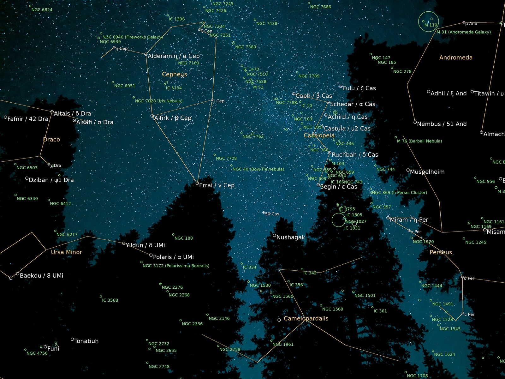

*The worst-case frame from §3, solved and annotated end-to-end — Cepheus,
Cassiopeia, and Ursa Minor threading between the trees. A two-flag scale
hint brought it home in 8.5 minutes where the classic pipeline gave up.*

**Offline operation** was verified the blunt way: after `--prefetch --hd`,
the pipeline was re-run with all HTTP(S) traffic pointed at a dead proxy
and uv in `--offline` mode — solve plus full annotation in 1.5 s, zero
network:

```console
$ ./psa.py --prefetch --hd            # one-time bootstrap, ~45 MB
$ env http_proxy=http://127.0.0.1:9 https_proxy=http://127.0.0.1:9 \
      uv run --offline psa.py stack.fits --hd
...
  solved in 1.5s using index-4111.fits
  drew 1 constellations, 2 named + 1 bayer stars, 1 NGC/IC, 248 HD
```

## 11. Limitations

- **Truly blind ultra-wide frames are slow.** With EXIF stripped and no
  hints, a 60°+ field means searching the full scale ladder — minutes, not
  seconds (the same is true of `solve-field`). One `--scale-low/high` pair
  fixes it.
- **Platforms.** The `astrometry` wheel covers Linux and macOS; Windows
  users need WSL. On 32/64-bit ARM (e.g. Raspberry Pi) it compiles from
  source on install, which works but needs a C toolchain.
- **Not reproduced from the classic pipeline:** solve-field's auxiliary
  products (`.axy`, `.corr`, `.rdls`, `.new`, `-indx.xyls`). The `.wcs` +
  `solution.json` pair covers their practical uses; the `.wcs` remains
  compatible with any astrometry.net tool that wants to regenerate them.

## 12. References

**Algorithm**
- Lang, D., Hogg, D. W., Mierle, K., Blanton, M., & Roweis, S. 2010,
  *Astrometry.net: Blind astrometric calibration of arbitrary astronomical
  images*, AJ 139, 1782 — [arXiv:0910.2233](https://arxiv.org/abs/0910.2233)
- Bertin, E. & Arnouts, S. 1996, *SExtractor: Software for source
  extraction*, [A&AS 117, 393](https://ui.adsabs.harvard.edu/abs/1996A%26AS..117..393B)
- Barbary, K. 2016, *SEP: Source Extractor as a library*,
  [JOSS 1(6), 58](https://doi.org/10.21105/joss.00058)
- Greisen, E. W. & Calabretta, M. R. 2002, *Representations of world
  coordinates in FITS* (Papers [I](https://ui.adsabs.harvard.edu/abs/2002A%26A...395.1061G)
  & [II](https://ui.adsabs.harvard.edu/abs/2002A%26A...395.1077C))
- Shupe, D. L. et al. 2005, *The SIP convention for representing distortion
  in FITS image headers*, [ASPC 347, 491](https://ui.adsabs.harvard.edu/abs/2005ASPC..347..491S)

**Software & services**
- astrometry.net — <http://astrometry.net> · index data —
  <https://data.astrometry.net>
- `astrometry` (engine wheel) —
  <https://github.com/neuromorphicsystems/astrometry>
- astropy — <https://docs.astropy.org> · sep — <https://sep.readthedocs.io>
  · Pillow — <https://pillow.readthedocs.io>
- uv — <https://docs.astral.sh/uv/> ·
  PEP 723 — <https://peps.python.org/pep-0723/>

**Data**
- Tycho-2: Høg, E. et al. 2000, [A&A 355, L27](https://ui.adsabs.harvard.edu/abs/2000A%26A...355L..27H)
  (4100-series indexes) · 2MASS: Skrutskie, M. F. et al. 2006,
  [AJ 131, 1163](https://ui.adsabs.harvard.edu/abs/2006AJ....131.1163S)
  (4200-series indexes)
- d3-celestial data (constellation lines, star designations), Olaf Frohn,
  BSD-3 — <https://github.com/ofrohn/d3-celestial>
- IAU Working Group on Star Names, *IAU Catalog of Star Names* —
  <https://www.pas.rochester.edu/~emamajek/WGSN/IAU-CSN.txt>
- OpenNGC, Mattia Verga, CC-BY-SA-4.0 —
  <https://github.com/mattiaverga/OpenNGC>
- Henry Draper Catalogue: Cannon, A. J. & Pickering, E. C. 1918–1924
  (VizieR [III/135A](https://vizier.cds.unistra.fr/viz-bin/VizieR?-source=III/135A));
  kd-tree form from <http://data.astrometry.net/hd.fits>
